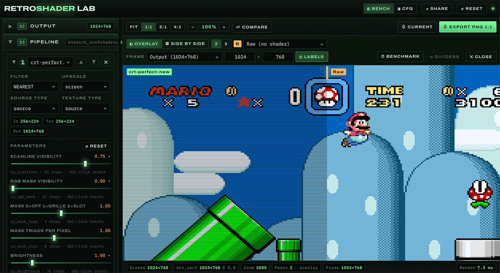

<div align="center">

# RetroShader Lab

**A browser bench for authoring and testing [NextUI](https://github.com/LoveRetro/NextUI) GLSL retro shader pipelines.**


[Features](#features) · [Quick start](#quick-start) · [How it works](#how-it-works) · [CFG format](#cfg-format) · [Credits](#credits--licensing)

</div>



**[👉 Open the lab](https://sinedied.github.io/retroshader-lab/)**

## Overview

Tuning shaders on a handheld is slow: edit a `.cfg`, copy it to the SD card, boot a game, squint, repeat. RetroShader Lab runs **the same pipeline in the browser** so you can iterate in milliseconds, then save a `.cfg` that drops straight onto the device.

The pipeline is a port of NextUI's `generic_video.c` / `ma_config.c`: identical pass sizing rules, identical uniform contract, identical GLSL preprocessing, identical `#pragma parameter` quantization.

## Features

- **1–3 shader passes** with the exact NextUI options: `filter`, `srctype`, `scaletype`, `upscale` (`1×`–`8×` or `screen`)
- **27 stock shaders and presets** from NextUI and [perfect-retroshaders](https://github.com/sinedied/perfect-retroshaders), plus your own added from a file or a URL
- **Shader parameters** parsed from `#pragma parameter` and snapped to NextUI's discrete steps
- **Real game screenshots** at native resolution, generated test patterns at console resolutions, or your own image
- **Pixel-honest viewport** — 1:1 by default, zoom up to 16× with drag-to-pan, and PNG export at 1:1
- **Compare up to 3 pipelines** under a movable overlay divider or as side-by-side columns that pan together
- **Live `.cfg`** you can edit, download or load back — unknown keys (core options like `gambatte_*`) are preserved
- **Share the whole setup as a link**, and save your own presets in the browser

## Quick start

The lab runs entirely in the browser — try it at **[sinedied.github.io/retroshader-lab](https://sinedied.github.io/retroshader-lab/)**, or run it locally:

```bash
npm install
npm run dev
```

Then open <http://localhost:5180>.

| Script | What it does |
| --- | --- |
| `npm run dev` | Regenerates the asset manifest and starts Vite |
| `npm run build` | Manifest + typecheck + production build into `dist/` |
| `npm run preview` | Serves the production build |

> [!NOTE]
> A WebGL2-capable browser is required — the same GLSL ES 3.0 / 1.0 dual path NextUI relies on.

### Using your own screenshots

The lab ships with 16 native-resolution game screenshots (2 per platform) in `public/samples/`. To add yours, drop an image onto the source panel, or bundle it permanently:

```bash
cp my-screenshot.png public/samples/
npm run dev   # the manifest picks up public/samples automatically
```

They then appear in the **Game screenshots** dropdown.

### Comparing pipelines

Hit **Compare** in the viewport toolbar to put 2 or 3 panes on screen. Pane A is always the pipeline you are editing; the others show the raw source (the default), any stock preset, or one of your own saved presets — those are listed first, under **Your presets**. A pane follows the preset it points at: update it and the pane re-renders, rename it and the label changes, delete it and the pane falls back to the raw source and says so.

| Layout | Behaviour |
| --- | --- |
| **Overlay** | Panes are clipped by a movable divider (two dividers for 3 panes) so the result reads as a single image |
| **Side by side** | Fixed equal columns, each showing the *same* region of the scene; dragging pans them all together |

While comparing, **Export PNG 1:1** writes the comparison exactly as laid out. **Current** exports just the edited pipeline.

### Presets

The stock configs are bundled in `public/shaders/presets/`. Pick one in the **Presets** dropdown of the cfg panel and the whole pipeline — passes, filters, scaling and shader parameters — is applied at once.

**Save preset** stores the pipeline you are working on in the browser as a user preset. Your presets are listed first, above the stock ones, and can be renamed, updated to the current pipeline or deleted. A dot next to the name means the pipeline has diverged from what was saved.

A user preset holds the same cfg text the panel shows, so loading one is identical to loading a `.cfg` file — including any core options it carries.

### Recolouring a Game Boy screenshot

Game Boy shots are usually captured in flat greyscale. `npm run palette` recolours one into any of Gambatte's 543 palettes:

```bash
npm run palette -- --list "TWB64 04"
npm run palette -- public/samples/gb-tetris.png "TWB64 040 - DMG Ver."
```

Indexed PNGs — what most screenshots are — are recoloured by rewriting the palette chunk, so the pixels themselves are untouched. Colours are quantized to 5 bits per channel the way Gambatte packs them, so they match what the handheld displays.

### Adding your own shader

Open the **Shaders** tab in the right dock. You can drop a `.glsl` file on it, pick one from disk, or fetch one from a URL. Anything you add is kept in `localStorage`, appears in every pass dropdown (there is an **＋ Add shader…** shortcut there too) and can be deleted from the same tab.

A shader is compiled before it is stored, so a broken one is reported with its compile log instead of silently rendering as an empty pass. Names are always normalised to `.glsl` and can never shadow a bundled shader — presets reference shaders by file name, so a custom `crt-perfect.glsl` would otherwise change what every stock preset renders; collisions get a `-2` suffix instead.

> [!NOTE]
> Loading from a URL is an ordinary browser `fetch`, so it only works if the server sends CORS headers. Raw GitHub links and CDNs do; most plain web servers do not. There is no way around that without a server to proxy through, so for anything else download the file and add it from disk.

To ship a shader with the project instead, drop it in `public/shaders/glsl/` and re-run `npm run dev`.

### Sharing a setup

**Share** copies a link that reproduces what you are looking at: the pipeline and its parameters, the comparison and its frame, the source, zoom and pan, and which panels are open.

The whole thing rides in the URL fragment, compressed. That keeps it off the server entirely — no request carries it, so nothing can reject or log it — and how much it costs depends on what you are sharing. Keep in mind that if there's too much data (like big custom shaders and presets), it will not fit in a URL at all and you will get an error message.

> [!NOTE]
> Opening someone's link does **not** touch your own saved session — it is applied for viewing only, and becomes yours the moment you change something. An uploaded screenshot cannot travel in a link, so the recipient sees the selected sample instead; you are told when that applies.

If a shared shader has the same name as one of yours but different contents, yours is kept and the incoming one is renamed, with the pipeline repointed at it.

If a comparison pane uses one of your own presets, the preset travels with the link so the pane renders for the recipient — but it is only held for their session, and never added to their saved presets.

## How it works

The render graph mirrors NextUI exactly:

```
source texture ──▶ pass 1 (FBO) ──▶ pass 2 (FBO) ──▶ pass 3 (FBO) ──▶ default.glsl ──▶ screen
```

**Per-pass sizing** (`upscale` → `scale`, where `screen` is scale 9):

| Value | `InputSize` (`srctype`) | `TextureSize` (`scaletype`) | `OutputSize` |
| --- | --- | --- | --- |
| `source` | original source size | original source size | `last × scale` |
| `relative` | previous pass output | previous pass output | `last × scale` |

**GLSL preprocessing**, ported from `load_shader_from_file()`:

1. every `#pragma parameter` line is stripped
2. `#version 110…450` becomes `#version 300 es`; a missing `#version` becomes `#version 100`
3. `#define VERTEX` or `#define FRAGMENT` + the ES precision block is inserted after the version line
4. `PARAMETER_UNIFORM` is defined **for the fragment stage only** — so parameters used in a vertex stage
   fall back to their compile-time defaults, exactly like on the device

The intermediate target of pass *N* is created with pass *N+1*'s filter, and the source texture uses pass 1's filter — the subtle detail that makes `NEAREST`/`LINEAR` chains behave identically.

**Destination rect**, ported from `selectScaler()` + `setRectToAspectRatio()`:

| Mode | Rect |
| --- | --- |
| `Native` | `src × min(⌊W/w⌋, ⌊H/h⌋)`, centered |
| `Cropped` | `src × min(⌈W/w⌉, ⌈H/h⌉)`, centered (overscans) |
| `Aspect` | height-driven fit of the core aspect ratio, clamped to width |
| `Aspect (screen)` | same fit using the source's own aspect |
| `Fullscreen` | the whole screen (stretch) |

## CFG format

The exported file is a `minarch` config, ready to be used as `<rom>.cfg` or as a preset in `Shaders/`:

```ini
minarch_screen_scaling = Aspect
minarch_scale_filter = NEAREST

minarch_nrofshaders = 2
minarch_shader1 = pixellate.glsl
minarch_shader1_filter = NEAREST
minarch_shader1_srctype = source
minarch_shader1_scaletype = source
minarch_shader1_upscale = 2
minarch_shader2 = scanline.glsl
minarch_shader2_filter = NEAREST
minarch_shader2_srctype = relative
minarch_shader2_scaletype = relative
minarch_shader2_upscale = screen

INTERPOLATE_IN_LINEAR_GAMMA = 1.00
```

> [!TIP]
> Loading a cfg keeps every key it does not own — core options such as `gambatte_gb_internal_palette` survive a full round-trip through the lab.

## Credits & licensing

RetroShader Lab is © 2026 Yohan Lasorsa and released under the **GNU GPL v3 or later** (see `LICENSE`), matching the license of NextUI it is derived from.

- **Shaders and presets** in `public/shaders/` are byte-identical copies from two upstreams: [NextUI](https://github.com/LoveRetro/NextUI) (GPL-3.0) for most of them, and [perfect-retroshaders](https://github.com/sinedied/perfect-retroshaders) (MIT, same author as this lab) for the `crt-perfect`, `lcd-perfect` and `pixel-perfect` family. Most of the NextUI shaders originate from the [libretro GLSL collection](https://github.com/libretro/glsl-shaders) and keep the license stated in their own header — see `public/shaders/NOTICE`.
- **Screenshots** in `public/samples/` come from [libretro-thumbnails](https://github.com/libretro-thumbnails/libretro-thumbnails) `Named_Snaps` (captured with shaders and filters off, at native resolution). They depict copyrighted works that remain the property of their respective publishers and are **not** covered by this project's license — see `public/samples/NOTICE`.
